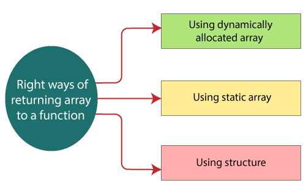

# Programming Questions

## Basic Questions:

1. Diff Between Compiled Language and interpreted Language?
    - Interpreted Language
      - Executed line by line.
      - No need for compilation.
      - Slower than compiled.
      - Ex: Python, R, Javascript
    - Compiled Language:
      - First full code is converted to machine code.
      - Runs faster
2. Compile Time error vs Runtime error?
   1. Compile-time is the time at which the source code is converted into an executable code
   2. Run time is the time at which the executable code is started running.

    - Compile-time errors are the errors that occurred when we write the wrong syntax. If we write the wrong syntax or semantics of any programming language, then the compile-time errors will be thrown by the compiler. The compiler will not allow to run the program until all the errors are removed from the program. When all the errors are removed from the program, then the compiler will generate the executable file.

    The compile-time errors can be:

    - Syntax errors
        - When the programmer does not follow the syntax of any programming language, then the compiler will throw the syntax error.
        For example,

        int a, b:

        The above declaration generates the compile-time error as in C, every statement ends with the semicolon, but we put a colon (`:`) at the end of the statement.
    - Semantic errors
        - The semantic errors exist when the statements are not meaningful to the compiler.

   - The runtime errors are the errors that occur during the execution and after compilation. The examples of runtime errors are division by zero, etc. These errors are not easy to detect as the compiler does not point to these errors.

3. What are the steps of compilation of c program?
    - ! [c-compilation_process]()

## C
### Theory

#### Basics
1. What are storage class specifiers in C? [geeksforgeeks](https://www.geeksforgeeks.org/storage-classes-in-c/)
    Ans: C Storage Classes are used to describe the features of a variable/function. These features basically include the scope, visibility, and lifetime which help us to trace the existence of a particular variable during the runtime of a program

    

    - Auto:
        - default storage class specifier.
        ``` c
        #include <stdio.h>
        int main(){
            int a = 10,i;
            printf("%d ",++a);
        {
            int a = 20;
            for (i=0;i<3;i++) {
                printf("%d ",a); // 20 will be printed 3 times since it is the local value of a
            }
        }
            printf("%d ",a); // 11 will be printed since the scope of a = 20 is ended.
        }
        ```
        ```
        $ garbage garbage garbage
        ```
    - Extern:
        - variable is defined elsewhere and not within the same block where it is used.
        - extern variable is nothing but a global variable initialized
        ```c
        #include <stdio.h>
        int main()
        {
            extern int a;
            printf("%d",a);
        }
        ```
        ```
        main.c:(.text+0x6): undefined reference to `a'
        collect2: error: ld returned 1 exit status
        ```
    - Static:
      - declare static variables which are popularly used while writing programs in C language. Static variables have the property of preserving their value even after they are out of their scope! Hence, static variables preserve the value of their last use in their scope
      - The variables defined as static specifier can hold their value between the multiple function calls.
      - Static local variables are visible only to the function or the block in which they are defined.
      - A same static variable can be declared many times but can be assigned at only one time.
      - Default initial value of the static integral variable is 0 otherwise null.
      - The visibility of the static global variable is limited to the file in which it has declared.
      - The keyword used to define static variable is static.
        ```c
        #include<stdio.h>
        static char c;
        static int i;
        static float f;
        static char s[100];
        void main () {
            printf("%d %d %f %s",c,i,f); // the initial default value of c, i, and f will be printed.
        }
        ```
        ```
        0 0 0.000000 (null)
        ```
        ```c
        #include<stdio.h>
        void sum()
        {
            static int a = 10;
            static int b = 24;
            printf("%d %d \n",a,b);
            a++;
            b++;
        }

        void main()
        {
            int i;
            for(i = 0; i< 3; i++)
            {
                sum(); // The static variables holds their value between multiple function calls.
            }
        }
        ```
        ```
        10 24
        11 25
        12 26
        ```
    - Register:
        - declares register variables that have the same functionality as that of the auto variables.
        - The only difference is that the compiler tries to store these variables in the register of the microprocessor if a free register is available. This makes the use of register variables to be much faster than that of the variables stored in the memory during the runtime of the program.
        - If a free registration is not available, these are then stored in the memory only.
        - The variables defined as the register is allocated the memory into the CPU registers depending upon the size of the memory remaining in the CPU.
        - We can not dereference the register variables, i.e., we can not use &operator for the register variable.
        - The access time of the register variables is faster than the automatic variables.
        - The initial default value of the register local variables is 0.
        - The register keyword is used for the variable which should be stored in the CPU register. However, it is compiler?s choice whether or not; the variables can be stored in the register.
        - We can store pointers into the register, i.e., a register can store the address of a variable.
        - Static variables can not be stored into the register since we can not use more than one storage specifier for the same variable.
        ```c
        #include <stdio.h>
        int main()
        {
            register int a; // variable a is allocated memory in the CPU register. The initial default value of a is 0.
            printf("%d",a);
        }
        ```
        ```
        0
        ```
2. What are qualifiers in C? [https://www.javatpoint.com/type-qualifiers-in-c](https://www.javatpoint.com/type-qualifiers-in-c)
   - Type qualifiers are keywords that can be used to change a data type's behavior in the C programming language. These qualifiers can be used to describe a variable or pointer's constancy, volatility, restrictions, and others.
     - const
       - If any variable is declared as a const in the code and is initialized with a value, its value cannot be furtherly modified in any part of the code. It results in a compile-time error if the programmer attempts to modify the value of such variables, which are declared const.
        ```c
        #include <stdio.h>
        int main() {
            const int  y=10;
            printf("The value of const variable y is %d",y);
            y=11;
            printf("The value of variable after modification is %d",y);
            return 0;
        }
        ```
        ```
        Q: What will happen when we try to modify const var?
            compile time error? runtime error
        A: Compile Time error
        ```

     - volatile
       - [Q3]
     - restrict
     -
3. What is Volatile Keyword? [geeksforgeeks](https://www.geeksforgeeks.org/understanding-volatile-qualifier-in-c/)
    - The volatile keyword is intended to prevent the compiler from applying any optimizations on objects that can change in ways that cannot be determined by the compiler.
    - Objects declared as volatile are omitted from optimization because their values can be changed by code outside the scope of current code at any time.
    - The system always reads the current value of a volatile object from the memory location rather than keeping its value in a temporary register.
4. Dynamic Mem Alloc?
   - The concept of dynamic memory allocation in c language enables the C programmer to allocate memory at runtime. Dynamic memory allocation in c language is possible by 4 functions of stdlib.h header file.
     - `malloc()`, `calloc()`. `realloc()`, `free()` are part of `stdlib.h`
     - malloc
       - The malloc() function allocates single block of requested memory.
       - It doesn't initialize memory at execution time, so it has garbage value initially.
       - It returns NULL if memory is not sufficient.
       - The syntax of malloc() function is given below:
         - `ptr=(cast-type*)malloc(byte-size)`
         - ` ptr=(int*)malloc(n*sizeof(int));  //memory allocated using malloc `
     - calloc
        - The calloc() function allocates multiple block of requested memory.
        - It initially initialize all bytes to zero.
        - It returns NULL if memory is not sufficient.
        - syntax:
          - ` ptr=(cast-type*)calloc(number, byte-size)  `
          - `ptr=(int*)calloc(n,sizeof(int));  //memory allocated using calloc    `
     - realloc
       - reallocates the memory occupied by malloc() or calloc() functions.
       - If memory is not sufficient for malloc() or calloc(), you can reallocate the memory by realloc() function. In short, it changes the memory size.
       - Syntax:
         - `ptr=realloc(ptr, new-size)  `
     - free
        - frees the dynamically allocated memory.


#### Pointers
1. What are pointers? [https://www.javatpoint.com/c-pointers](https://www.javatpoint.com/c-pointers)
   - The pointer in C language is a variable which stores the address of another variable. This variable can be of type int, char, array, function, or any other pointer. The size of the pointer depends on the architecture. However, in 32-bit architecture the size of a pointer is 2 byte.
   - Pointer to arrey
    ```c
    int arr[10];
    int *p[10]=&arr; // Variable p of type pointer is pointing to the address of an integer array arr.
    ```
   - Address of &: The address of operator '&' returns the address of a variable. But, we need to use %u to display the address of a variable.
    ```c
    #include<stdio.h>
    int main(){
    int number=50;
    printf("value of number is %d, address of number is %u",number,&number);
    return 0;
    }
    ```

    Q: How to read this? ` int (*p)[10]`
    A: p is apointer to a array of size 10

2. What are functions pointer? [geeksforgeeks](https://www.geeksforgeeks.org/function-pointer-in-c/)
    - pointer pointing to a function
    - syntax
      - ` return type (*ptr_name)(type1, type2…);  `
      - `int (*ip) (int);  `
        -   *ip is a pointer that points to a function which returns an int value and accepts an integer value as an argument.
      -
        ```
        float (*fp) (int , int);    // Declaration of a function pointer.
        float func( int , int );    // Declaration of  function.
        fp = func;                     // Assigning address of func to the fp pointer.
      ```
    - what do we mean by this?
    - ` void (*fun_ptr_arr[3])(int, int);`
    -

    - Reading pointers
     Q: how do you read this? `int (*p)(int (*)[2], int (*)void)) `
     Ans: p is a pointer to such function which accepts the first parameter as the pointer to a one-dimensional array of integers of size two and the second parameter as the pointer to a function which parameter is void and return type is the integer.
3. What is inline?
4.
#### Dry Run
1. What is the error in the below code
    ```c
    #include <stdio.h>
    int *getarray()
    {
        int arr[5];
        printf("Enter the elements in an array : ");
        for(int i=0;i<5;i++)
        {
            scanf("%d", &arr[i]);
        }
        return arr;
    }
    int main()
    {
    int *n;
    n=getarray();
    printf("\nElements of array are :");
    for(int i=0;i<5;i++)
        {
            printf("%d", n[i]);
        }
        return 0;
    }
    ```
    Ans:
    In the above program, `getarray()` function returns a variable `arr`. It returns a local variable, but it is an illegal memory location to be returned, which is allocated within a function in the stack. Since the program control comes back to the `main()` function, and all the variables in a stack are freed. Therefore, we can say that this program is returning memory location, which is already de-allocated, so the output of the program is a `segmentation fault `.


    Fix:
        - Theory:
          - Dynamic Array
          - static arrya
          - Static Variable( pointer)
        

    ```c
    #include <stdio.h>
    #include<malloc.h>
    int *getarray()
    {
        int size;
        printf("Enter the size of the array : ");
        scanf("%d",&size);
        int *p= malloc(sizeof(size));
        printf("\nEnter the elements in an array");
        for(int i=0;i<size;i++)
        {
            scanf("%d",&p[i]);
        }
        return p;
    }
    int main()
    {
    int *ptr;
    ptr=getarray();
    int length=sizeof(*ptr);
    printf("Elements that you have entered are : ");
    for(int i=0;ptr[i]!='\0';i++)
        {
        printf("%d ", ptr[i]);
        }
    return 0;
    }
    ```
### Programs
1. Reverse a string
2. Write an assembly code for sum of two numbers? ( if candidate knows ARM assembly)
3. Swag two numbers using pointers without 3rd variable?
    ```c
    #include<stdio.h>
    int main(){
    int a=10,b=20,*p1=&a,*p2=&b;

    printf("Before swap: *p1=%d *p2=%d",*p1,*p2);
    *p1=*p1+*p2;
    *p2=*p1-*p2;
    *p1=*p1-*p2;
    printf("\nAfter swap: *p1=%d *p2=%d",*p1,*p2);

    return 0;
    }
    ```
4.

####
## Python