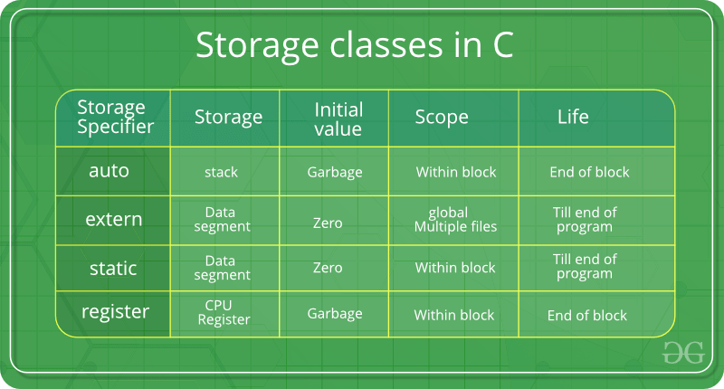

# Programming Questions

## Basic Questions:

1. Diff Between Compiled Language and interpreted Language?
    - Interpreted Language
      - Executed line by line.
      - No need for compilation.
      - Slower than compiled.
      - Ex: Python, R, Javascript
    - Compiled Language:
      - First full code is converted to machine code.
      - Runs faster
2. Compile Time error vs Runtime error?
   1. Compile-time is the time at which the source code is converted into an executable code
   2. Run time is the time at which the executable code is started running.

    - Compile-time errors are the errors that occurred when we write the wrong syntax. If we write the wrong syntax or semantics of any programming language, then the compile-time errors will be thrown by the compiler. The compiler will not allow to run the program until all the errors are removed from the program. When all the errors are removed from the program, then the compiler will generate the executable file.

    The compile-time errors can be:

    - Syntax errors
        - When the programmer does not follow the syntax of any programming language, then the compiler will throw the syntax error.
        For example,

        int a, b:

        The above declaration generates the compile-time error as in C, every statement ends with the semicolon, but we put a colon (`:`) at the end of the statement.
    - Semantic errors
        - The semantic errors exist when the statements are not meaningful to the compiler.

   - The runtime errors are the errors that occur during the execution and after compilation. The examples of runtime errors are division by zero, etc. These errors are not easy to detect as the compiler does not point to these errors.

3. What are the steps of compilation of c program?
    
    - The C compilation process can be broken down into four main stages, each contributing to the final product:
      1. Preprocessing: The First Step
        At the outset, the C preprocessor comes into play. It handles preprocessor directives, which begin with a `#` symbol, and includes header files in the code. When you use `#include <stdio.h>` , for example, the preprocessor replaces it with the content of the stdio.h file. This step generates an intermediate code with all the necessary declarations and macros.
      2. Compilation: Translating to Assembly
        Once preprocessing is complete, the actual compilation commences. The compiler takes the C code and translates it into assembly code, specific to the target platform. Assembly code represents a low-level view of the program, consisting of instructions that the processor can execute.
      3. Assembly: From Assembly to Machine Code
        Next, the assembler converts the assembly code into machine code, also known as object code. The object code consists of binary representations of instructions and data. This step is a crucial bridge between human-readable code and the language the computer understands.
      4. Linking: Bringing It All Together
        Now that we have object files with machine code, the linker takes center stage. It resolves external dependencies, such as functions from libraries or other object files, and combines all the object files into a single executable. The linker ensures that the final program is self-contained and ready to run.

    ##### Compilation Commads
    - ###### Preprocessing:
      - In this stage, `#include` gets replaced with the contents of the header file stdio.h. You can use the -E flag to output the preprocessed
        ` gcc -E test.c -o test.i `
      - The output file test.i will contain a lot of code, including our original program plus the entire contents of stdio.h and the files it includes.

    - ###### Compilation:
      - The preprocessed code is turned into assembly instructions specific to your processor. Use the -S flag to output the assembly code:
        ` gcc -S test.i -o test.s `
      - The output test.s will contain the assembly code of our program.


    - ###### Assembly:
      - The assembly code is converted into machine instructions (object code). Use the -c flag to output the object code:
        ` gcc -c test.s -o test.o `
      - The file test.o will contain binary code, which is not human-readable but can be inspected using tools like objdump.

    - ###### Linking:
      - All the object files and libraries are linked together to create a single executable:
        `gcc test.o -o test `

      - The output test is an executable file. You can run it with ./test and it will print "Sum is: 10".

4. Memoy Layout of a C program?
    A typical memory representation of a C program consists of the following sections.

    - Text segment  (i.e. instructions)
      - A text segment, also known as a code segment or simply as text, is one of the sections of a program in an object file or in memory, which contains executable instructions.
      - As a memory region, a text segment may be placed below the heap or stack in order to prevent heaps and stack overflows from overwriting it.
    - Initialized data segment
      - Initialized data segment, usually called simply the Data Segment. A data segment is a portion of the virtual address space of a program, which contains the global variables and static variables that are initialized by the programmer.
    - Uninitialized data segment  (bss)
      -  Uninitialized data segment often called the “bss” segment, named after an ancient assembler operator that stood for “block started by symbol.” Data in this segment is initialized by the kernel to arithmetic 0 before the program starts executing uninitialized data starts at the end of the data segment and contains all global variables and static variables that are initialized to zero or do not have explicit initialization in source code.
      - For instance, a variable declared `static int i;` would be contained in the BSS segment.
      - For instance, a global variable `int j;` would be contained in the BSS segment.
    - Heap
      - Heap is the segment where dynamic memory allocation usually takes place.
    - Stack
      - The stack area traditionally adjoined the heap area and grew in the opposite direction; when the stack pointer met the heap pointer, free memory was exhausted.
      - Stacks contains the program stack
  - Questions:
    - Whare does dynamic mem allocation takes place?
    -
   


## C
### Theory

#### Basics
1. What are storage class specifiers in C? [geeksforgeeks](https://www.geeksforgeeks.org/storage-classes-in-c/)
    Ans: C Storage Classes are used to describe the features of a variable/function. These features basically include the scope, visibility, and lifetime which help us to trace the existence of a particular variable during the runtime of a program

    

    - Auto:
        - default storage class specifier.
        ``` c
        #include <stdio.h>
        int main(){
            int a = 10,i;
            printf("%d ",++a);
        {
            int a = 20;
            for (i=0;i<3;i++) {
                printf("%d ",a); // 20 will be printed 3 times since it is the local value of a
            }
        }
            printf("%d ",a); // 11 will be printed since the scope of a = 20 is ended.
        }
        ```
        ```
        $ garbage garbage garbage
        ```
    - Extern:
        - variable is defined elsewhere and not within the same block where it is used.
        - extern variable is nothing but a global variable initialized
        ```c
        #include <stdio.h>
        int main()
        {
            extern int a;
            printf("%d",a);
        }
        ```
        ```
        main.c:(.text+0x6): undefined reference to `a'
        collect2: error: ld returned 1 exit status
        ```
    - Static:
      - declare static variables which are popularly used while writing programs in C language. Static variables have the property of preserving their value even after they are out of their scope! Hence, static variables preserve the value of their last use in their scope
      - The variables defined as static specifier can hold their value between the multiple function calls.
      - Static local variables are visible only to the function or the block in which they are defined.
      - A same static variable can be declared many times but can be assigned at only one time.
      - Default initial value of the static integral variable is 0 otherwise null.
      - The visibility of the static global variable is limited to the file in which it has declared.
      - The keyword used to define static variable is static.
        ```c
        #include<stdio.h>
        static char c;
        static int i;
        static float f;
        static char s[100];
        void main () {
            printf("%d %d %f %s",c,i,f); // the initial default value of c, i, and f will be printed.
        }
        ```
        ```
        0 0 0.000000 (null)
        ```
        ```c
        #include<stdio.h>
        void sum()
        {
            static int a = 10;
            static int b = 24;
            printf("%d %d \n",a,b);
            a++;
            b++;
        }

        void main()
        {
            int i;
            for(i = 0; i< 3; i++)
            {
                sum(); // The static variables holds their value between multiple function calls.
            }
        }
        ```
        ```
        10 24
        11 25
        12 26
        ```
    - Register:
        - declares register variables that have the same functionality as that of the auto variables.
        - The only difference is that the compiler tries to store these variables in the register of the microprocessor if a free register is available. This makes the use of register variables to be much faster than that of the variables stored in the memory during the runtime of the program.
        - If a free registration is not available, these are then stored in the memory only.
        - The variables defined as the register is allocated the memory into the CPU registers depending upon the size of the memory remaining in the CPU.
        - We can not dereference the register variables, i.e., we can not use &operator for the register variable.
        - The access time of the register variables is faster than the automatic variables.
        - The initial default value of the register local variables is 0.
        - The register keyword is used for the variable which should be stored in the CPU register. However, it is compiler?s choice whether or not; the variables can be stored in the register.
        - We can store pointers into the register, i.e., a register can store the address of a variable.
        - Static variables can not be stored into the register since we can not use more than one storage specifier for the same variable.
        ```c
        #include <stdio.h>
        int main()
        {
            register int a; // variable a is allocated memory in the CPU register. The initial default value of a is 0.
            printf("%d",a);
        }
        ```
        ```
        0
        ```
2. What are qualifiers in C? [https://www.javatpoint.com/type-qualifiers-in-c](https://www.javatpoint.com/type-qualifiers-in-c)
   - Type qualifiers are keywords that can be used to change a data type's behavior in the C programming language. These qualifiers can be used to describe a variable or pointer's constancy, volatility, restrictions, and others.
     - const
       - If any variable is declared as a const in the code and is initialized with a value, its value cannot be furtherly modified in any part of the code. It results in a compile-time error if the programmer attempts to modify the value of such variables, which are declared const.
        ```c
        #include <stdio.h>
        int main() {
            const int  y=10;
            printf("The value of const variable y is %d",y);
            y=11;
            printf("The value of variable after modification is %d",y);
            return 0;
        }
        ```
        ```
        Q: What will happen when we try to modify const var?
            compile time error? runtime error
        A: Compile Time error
        ```

     - volatile
       - [Q3]
     - restrict
     -
3. What is Volatile Keyword? [geeksforgeeks](https://www.geeksforgeeks.org/understanding-volatile-qualifier-in-c/)
    - The volatile keyword is intended to prevent the compiler from applying any optimizations on objects that can change in ways that cannot be determined by the compiler.
    - Objects declared as volatile are omitted from optimization because their values can be changed by code outside the scope of current code at any time.
    - The system always reads the current value of a volatile object from the memory location rather than keeping its value in a temporary register.
4. Dynamic Mem Alloc?
   - The concept of dynamic memory allocation in c language enables the C programmer to allocate memory at runtime. Dynamic memory allocation in c language is possible by 4 functions of stdlib.h header file.
     - `malloc()`, `calloc()`. `realloc()`, `free()` are part of `stdlib.h`
     - malloc
       - The malloc() function allocates single block of requested memory.
       - It doesn't initialize memory at execution time, so it has garbage value initially.
       - It returns NULL if memory is not sufficient.
       - The syntax of malloc() function is given below:
         - `ptr=(cast-type*)malloc(byte-size)`
         - ` ptr=(int*)malloc(n*sizeof(int));  //memory allocated using malloc `
     - calloc
        - The calloc() function allocates multiple block of requested memory.
        - It initially initialize all bytes to zero.
        - It returns NULL if memory is not sufficient.
        - syntax:
          - ` ptr=(cast-type*)calloc(number, byte-size)  `
          - `ptr=(int*)calloc(n,sizeof(int));  //memory allocated using calloc    `
     - realloc
       - reallocates the memory occupied by malloc() or calloc() functions.
       - If memory is not sufficient for malloc() or calloc(), you can reallocate the memory by realloc() function. In short, it changes the memory size.
       - Syntax:
         - `ptr=realloc(ptr, new-size)  `
     - free
        - frees the dynamically allocated memory.

5. Diff between string and Array of chars?
   Ans: Str end with `\0`
6. What is NULL pointer?
   - The Null Pointer is the pointer that does not point to any location but NULL.
   -
7. What is void Pointer?
   - A void pointer is a pointer that has no associated data type with it. A void pointer can hold an address of any type and can be typecasted to any type.
8. Type Casting vs Tyep conversion?
    - Type Casting:
      - data type is converted into another data type by the programmer using the casting operator during the program design. In typing casting, the destination data type may be smaller than the source data type when converting the data type to another data type, that’s why it is also called narrowing conversion.
      - Syntax
        - ` destination_datatype = (target_datatype)variable;`
      - Chances of Data loss.
      -
    - Type Conversion:
      - In type conversion, a data type is automatically converted into another data type by a compiler at the compiler time. In type conversion, the destination data type cannot be smaller than the source data type, that’s why it is also called widening conversion. One more important thing is that it can only be applied to compatible data types
        - Explicit: Done by user from Higher to lower
        - Implitic Done by compiler from lower to higher
9. What is inline keyword?
10.
#### Pointers
1. What are pointers? [https://www.javatpoint.com/c-pointers](https://www.javatpoint.com/c-pointers)
   - The pointer in C language is a variable which stores the address of another variable. This variable can be of type int, char, array, function, or any other pointer. The size of the pointer depends on the architecture. However, in 32-bit architecture the size of a pointer is 2 byte.
   - Pointer to arrey
    ```c
    int arr[10];
    int *p[10]=&arr; // Variable p of type pointer is pointing to the address of an integer array arr.
    ```
   - Address of &: The address of operator '&' returns the address of a variable. But, we need to use %u to display the address of a variable.
    ```c
    #include<stdio.h>
    int main(){
    int number=50;
    printf("value of number is %d, address of number is %u",number,&number);
    return 0;
    }
    ```

    Q: How to read this? ` int (*p)[10]`
    A: p is apointer to a array of size 10

2. What are functions pointer? [geeksforgeeks](https://www.geeksforgeeks.org/function-pointer-in-c/)
    - pointer pointing to a function
    - syntax
      - ` return type (*ptr_name)(type1, type2…);  `
      - `int (*ip) (int);  `
        -   *ip is a pointer that points to a function which returns an int value and accepts an integer value as an argument.
      -
        ```
        float (*fp) (int , int);    // Declaration of a function pointer.
        float func( int , int );    // Declaration of  function.
        fp = func;                     // Assigning address of func to the fp pointer.
      ```
    - what do we mean by this?
    - ` void (*fun_ptr_arr[3])(int, int);`
    -

    - Reading pointers
     Q: how do you read this? `int (*p)(int (*)[2], int (*)void)) `
     Ans: p is a pointer to such function which accepts the first parameter as the pointer to a one-dimensional array of integers of size two and the second parameter as the pointer to a function which parameter is void and return type is the integer.
3. What is inline?
4.
#### Dry Run
1. What is the error in the below code
    ```c
    #include <stdio.h>
    int *getarray()
    {
        int arr[5];
        printf("Enter the elements in an array : ");
        for(int i=0;i<5;i++)
        {
            scanf("%d", &arr[i]);
        }
        return arr;
    }
    int main()
    {
    int *n;
    n=getarray();
    printf("\nElements of array are :");
    for(int i=0;i<5;i++)
        {
            printf("%d", n[i]);
        }
        return 0;
    }
    ```
    Ans:
    In the above program, `getarray()` function returns a variable `arr`. It returns a local variable, but it is an illegal memory location to be returned, which is allocated within a function in the stack. Since the program control comes back to the `main()` function, and all the variables in a stack are freed. Therefore, we can say that this program is returning memory location, which is already de-allocated, so the output of the program is a `segmentation fault `.


    Fix:
        - Theory:
          - Dynamic Array
          - static arrya
          - Static Variable( pointer)
        

    ```c
    #include <stdio.h>
    #include<malloc.h>
    int *getarray()
    {
        int size;
        printf("Enter the size of the array : ");
        scanf("%d",&size);
        int *p= malloc(sizeof(size));
        printf("\nEnter the elements in an array");
        for(int i=0;i<size;i++)
        {
            scanf("%d",&p[i]);
        }
        return p;
    }
    int main()
    {
    int *ptr;
    ptr=getarray();
    int length=sizeof(*ptr);
    printf("Elements that you have entered are : ");
    for(int i=0;ptr[i]!='\0';i++)
        {
        printf("%d ", ptr[i]);
        }
    return 0;
    }
    ```
2. Output of the below code (function pointer)?
   ```c
    #include <stdio.h>
    #include <stdint.h>
    #include <stdlib.h>

    int sum(int, int);
    int mystery_function(int , int , int (*)(int, int));

    typedef int (*my_function)(int, int, int(*)(int, int));

    int main()
    {
	    int (*sum_ptr)(int,int);
	    int (*fun_ptr)(int, int, int (*fn)(int, int)); // or my_function fun_ptr when using typedef

	    int a= 10;
	    int b= 20;

	    fun_ptr = &mystery_function;
	    sum_ptr = &sum;
	    int sumvar = (*sum_ptr)(a, b);
	    printf("Sum_ptr:%d\n", sumvar);

	    sumvar = (*fun_ptr)(a, b, &sum);
	    printf("Fun_ptr:%d\n", sumvar);
	    return 0;
    }

    int sum(int a, int b)
    {
	    printf("a:%d b:%d\n", a, b);
	    return(a+b);
    }

    int mystery_function(int a, int b, int (*fun)(int, int))
    {
	    return ((*fun)(a, b));
    }
   ```

   ```
    a:10 b:20
    Sum_ptr:30
    a:10 b:20
    Fun_ptr:30
   ```

3. Function pointer 2
    ```c
    #include <stdio.h>
    void f(int (*x)(int));
    int myfoo(int);
    int (*fooptr)(int);
    int ((*foo(int)))(int);
    int main()
    {
        fooptr = foo(0);
        fooptr(10);
    }
    int ((*foo(int i)))(int)
    {
        return myfoo;
    }
    int myfoo(int i)
    {
        printf("%d\n", i + 1);
    }
    ```
    ```
    11
    ```
4. Pointer
   ```c
    #include<stdio.h>
    #include<stdlib.h>

    void function1(int i)
    {
	    i=10;
	    printf("function1: %d\n", i);
    }

    void function2(int *i)
    {
	    if(i == NULL)
	    {	printf("allocating memory\t");
		    i= (int *)malloc(sizeof(int));
		    *i= 30;
	    }
	    else if(i != NULL)
	    {
		    *i=20;
		    printf("function2: %d 0x%p\n", *i, i);
	    }
    }

    int main()
    {
	    int a= 5;
	    printf("main a: %d\n", a);
	    function1(a);
	    printf("after function1 main a: %d\n", a);

	    int b=10;
	    printf("main b: %d, 0x%p\n", b, &b);
	    function2(&b);
	    printf("after function2 main b: %d 0x%p\n", b, &b);

    return 0;

    }
   ```

   ```
    main a: 5
    function1: 10
    after function1 main a: 5
    main b: 10, 0x0x7fff90831d48
    function2: 20 0x0x7fff90831d48
    after function2 main b: 20 0x0x7fff90831d48
    ```

### Programs
1. Reverse a sentence
   ```c
    #include<stdio.h>
    //function prototype to reverse
    //the string from begin to end
    void revString(char *pBegin, char *pEnd)
    {
        char temp;
        while (pBegin < pEnd)
        {
            temp = *pBegin;
            *pBegin++ = *pEnd;
            *pEnd-- = temp;
        }
    }
    // Function to reverse words
    void revWord(char *pString)
    {
        // store the beginning address of word
        char *word_begin = NULL;
        //word_boundary is for word boundary
        char *word_boundary = pString; /* */
        //Loop to reverse the character of words
        while( *word_boundary )
        {
            //This condition is to make sure that
            //the string start with valid character
            if (( word_begin == NULL ) && (*word_boundary != ' ') )
            {
                word_begin = word_boundary;
            }
            if(word_begin && ((*(word_boundary+1) == ' ') || (*(word_boundary+1) == '\0')))
            {
                revString(word_begin, word_boundary);
                word_begin = NULL;
            }
            word_boundary++;
        }
        // reverse the whole string
        revString(pString, word_boundary-1);
    }
    int main()
    {
        //source string
        char src[] = "How are you";
        //Reverse the word of the string
        revWord(src);
        //print the resultant string
        printf("Resultant string = %s", src);
        return 0;
    }
   ```
2. Write an assembly code for sum of two numbers? ( if candidate knows ARM assembly)

3. Swag two numbers using pointers without 3rd variable?
    ```c
    #include<stdio.h>
    int main(){
    int a=10,b=20,*p1=&a,*p2=&b;

    printf("Before swap: *p1=%d *p2=%d",*p1,*p2);
    *p1=*p1+*p2;
    *p2=*p1-*p2;
    *p1=*p1-*p2;
    printf("\nAfter swap: *p1=%d *p2=%d",*p1,*p2);

    return 0;
    }
    ```
4. Macro programs
   1. swap 2 numbers
   2. max of 2 numbers
   3. max of 3 numbers
   4.
    ```c
    #include <stdio.h>
    #include <stdint.h>
    #include <stdlib.h>

    #define swap(a, b) 	\
    {					\
	    a^=b;			\
	    b^=a;			\
	    a^=b;			\
    }

    #define max2(a,b) 	\
	    (a)>=(b) ? \
		    (a): 	\
		    (b)

    #define max3(a,b,c)		((a) >= (b)) ?	\
							((a)>= (c) ? (a) : (c)) :	\
							((b) >= (c)? (b) : (c))	\

    int main()
    {
	    int max;
	    printf("max2: %d\n", max2(1,2));
	    printf("max2: %d\n", max2(-1,-1));
	    printf("max2: %d\n", max2(10,10));
	    printf("max2: %d\n", max3(1,2,3));
    }
    ```

####
## Python
### Basics
1. Python Inheritance
   - When one class inherits from another, it is said to be the child/ derived/sub class inheriting from the parent/base/super class. It inherits/gains all members (attributes and methods). Inheritance lets us reuse our code, and also makes it easier to create and maintain applications.

    - Inheritance allows One class to gain all the members(say attributes and methods) of another class. Inheritance provides code reusability,makes it easier to create and maintain an application. The class from which we are inheriting is called super-class and the class that is inherited is called a derived/child class.

    - They are different types of inheritance supported by Python:
        - Single Inheritance
            - where a derived class acquires the members of a single super class.
            - Single Inheritance- A class inherits from a single base class.

       - Multi-level inheritance
           - a derived class d1 in inherited from base class base1, and d2 is inherited from base2.
           - Multilevel Inheritance- A class inherits from a base class, which in turn, inherits from another base class.
       - Hierarchical inheritance
           - from one base class you can inherit any number of child classes
           - Hierarchical Inheritance- Multiple classes inherit from a single base class.
       - Multiple inheritance
           - a derived class is inherited from more than one base class.
           - Multiple Inheritance- A class inherits from multiple base classes.
       - Hybrid Inheritance
            - Hybrid inheritance is a combination of two or more types of inheritance.
        ###### Q:
        1. Suppose class C inherits from classes A and B as class C(A,B).Classes A and B both have their own versions of method func(). If we call func() from an object of class C, which version gets invoked?
            - we discussed Method Resolution Order (MRO). C does not contain its own version of func(). Since the interpreter searches in a left-to-right fashion, it finds the method in A, and does not go to look for it in B.
2. What is MRO in python?[https://www.geeksforgeeks.org/method-resolution-order-in-python-inheritance/](https://www.geeksforgeeks.org/method-resolution-order-in-python-inheritance/)
    ```python
    class A:
	    def printSomething(self):
		print(" In class A")

    class B:
	    def printSomething(self):
		print(" In class B")

    # TODO: Inherit class A & B from C
    class C(A, B):
	    pass

    c = C()
    c.printSomething()
    ```
    ```
    In class A
    ```
3. What are setter and getter funtions?
4. What are decorators?
5.
6. Mutable and immutable datatypes
    - mutable
        - list
        - set
        - dict
    - immutable
        - tuple
        - string
        - numbers
7. Raising exceptions
    ```python
    try:
        risky_operation()
    except IndexError:  # Handle specific exception types first.
        handle_index_error()
    except Exception as e:  # More general exception must come last.
        handle_generic_error()
    finally:
        cleanup()
    ```
8. Diff between set/ tuple/list
    - List/Tuple
        - Lists and Tuples in Python share many similarities, such as being sequences and supporting indexing.

            However, these data structures differ in key ways:

            - Key Distinctions
                - Mutability: Lists are mutable, allowing you to add, remove, or modify elements after creation. Tuples, once created, are immutable.

                - Performance: Lists are generally slower than tuples, most apparent in tasks like iteration and function calls.

                - Syntax:
                  - Lists are defined with square brackets []
                    ```python
                    my_list = ["apple", "banana", "cherry"]
                    my_list.append("date")
                    my_list[1] = "blackberry"
                    ```
                  - tuples use parentheses ().
                    ```python
                    my_tuple = (1, 2, 3, 4)
                    a, b, c, d = my_tuple
                    ```

            - When to Use Each
                - Lists are ideal for collections that may change in size and content. They are the preferred choice for storing data elements.

                - Tuples, due to their immutability and enhanced performance, are a good choice for representing fixed sets of related data.


6. Diff between is and ==
   **The difference between `is` and `==`**
    * `is` operator checks if both the operands refer to the same object (i.e., it checks if the identity of the operands matches or not).
    * `==` operator compares the values of both the operands and checks if they are the same.
    * So `is` is for reference equality and `==` is for value equality. An example to clear things up,
    ```py
    >>> class A: pass
    >>> A() is A() # These are two empty objects at two different memory locations.
    False
    ```
7. What is lambda function?
   - A function which doesn't contain any name is known as a anonymous function lambda function, Lambda function we can assign to the variable & we can call the lambda function through the variable.
    - syntax
      - `Lambda arguments:expression`
    - Out
      - `(lambda a,b:a if a>b else b)(3,3.5)`
        - `3.5`
8. Use of `with` keyword?
   1. In python generally "with" statement is used to open a file, process the data present in the file, and also to close the file without calling a close() method. "with" statement makes the exception handling simpler by providing cleanup activities.
   2. `with open("filename", "mode") as file-var:`
9.  How will you remove last object from a list?
   1. `list.pop(obj=list[-1])`
10. What are Accessors, mutators, @property?
   Accessors and mutators are often called getters and setters in languages like "Java". For example, if x is a property of a user-defined class, then the class would have methods called setX() and getX(). Python has an @property 'decorator' that allows you to ad getters and setters in order to access the attribute of the class.
11. Differentiate between append() and extend() methods.?
   Both append() and extend() methods are the methods of list. These methods are used to add the elements at the end of the list.

    - `append(element`) – adds the given element at the end of the list which has called this method.
    - `extend(another-list)` – adds the elements of another-list at the end of the list which is called the extend method.

#### Dry runs
1. How do you pass optional params?
   1. How to force user to provide keyword arguments
   2.
   ```python
   def foo(arg1, *, arg2 ):
        print(arg1, arg2)
    ```

    ```foo(arg1=10, arg2=20)``` : ok
    ```foo(10, arg2=20)```: ok
    ```foo(10)```: error

2. ouput:
    ```python
    def funA(a):
        a[0]= 100
        print(a)
    a= [200,300,400,500]
    funA(a)
    print(a)
    ```
    ```
    [100,300,400,500]
    [100,300,400,500]
    ```
3. var id
    ```python
    >>> a = "some_string"
    >>> id(a)
    140420665652016
    >>> id("some" + "_" + "string")
    ??
    ```
4. output of the code:
    ```python
     try:
        if '1' != 1:
        raise
    ```
5. How to open a file c:\scores.txt for writing?
6. Output of below code?
    ```python
    x = ['ab', 'cd']
    print(len(map(list, x)))
    ```
7. Output

    ```python
    def fun(n):
        return n + n

    numbers = (1, 2, 3, 4)
    result = map(addition, numbers)
    print(list(result))
    ```
    ```python
    numbers = (1, 2, 3, 4)
    result = map(lambda x: x + x, numbers)
    print(list(result))
    ```
    ```
    [2, 4, 6, 8]
    ```
    ```python
    numbers1 = [1, 2, 3]
    numbers2 = [4, 5, 6]

    result = map(lambda x, y: x + y, numbers1, numbers2)
    print(list(result))
    ```
    ```
    [5, 7, 9]
    ```

    ```python
    # List of strings
    l = ['sat', 'bat', 'cat', 'mat']
    test = list(map(list, l))
    print(test)
    ```
    ```
    [['s', 'a', 't'], ['b', 'a', 't'], ['c', 'a', 't'], ['m', 'a', 't']]
    ```
### Programming
1. Write a sorting algorithm for a numerical dataset in Python?
    ```python
    list = ["1", "4", "0", "6", "9"]
    list = [int(i) for i in list]
    list.sort()
    print(list)
    ```

2. WAP Reading csv file?
    csv has 4 cols. has n rows
        - colA
        - colB
        - colC
        - colD
    1. sort the rows based on colA
    2. drop rows with empty vals in any col
    3. drop cols with empty vals in any row
    4. drop val only if colA is ampty
    5. sum of all row of col B
    6. sum of all rows of col C if val in colA is 'AAAA'
    7. add new column colE where the value is sum of colA and colD
    5.
3.  List comprehension
4.  Lambda function
5.  OOPS in python

